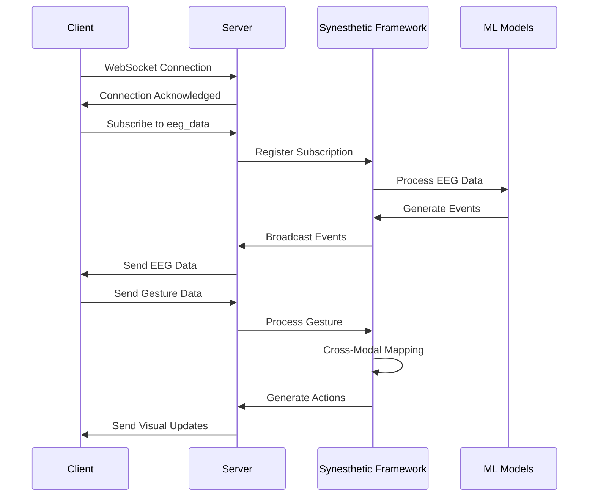
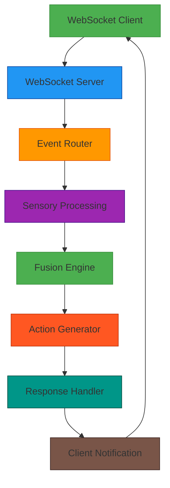
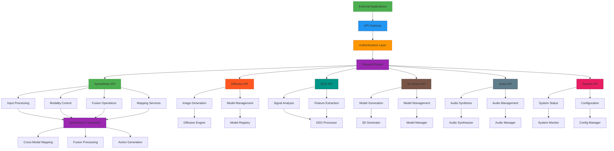
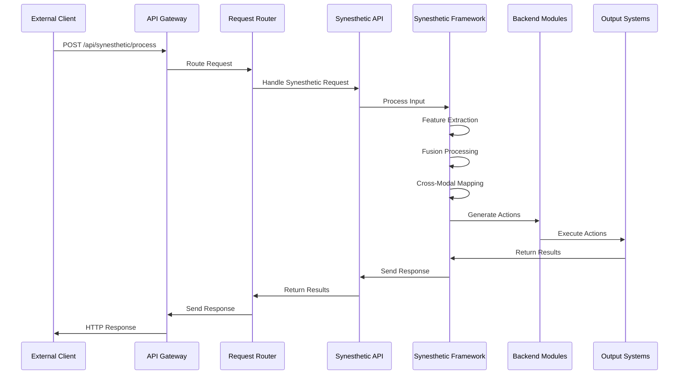
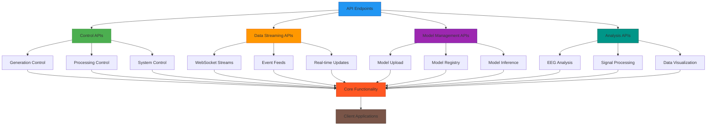
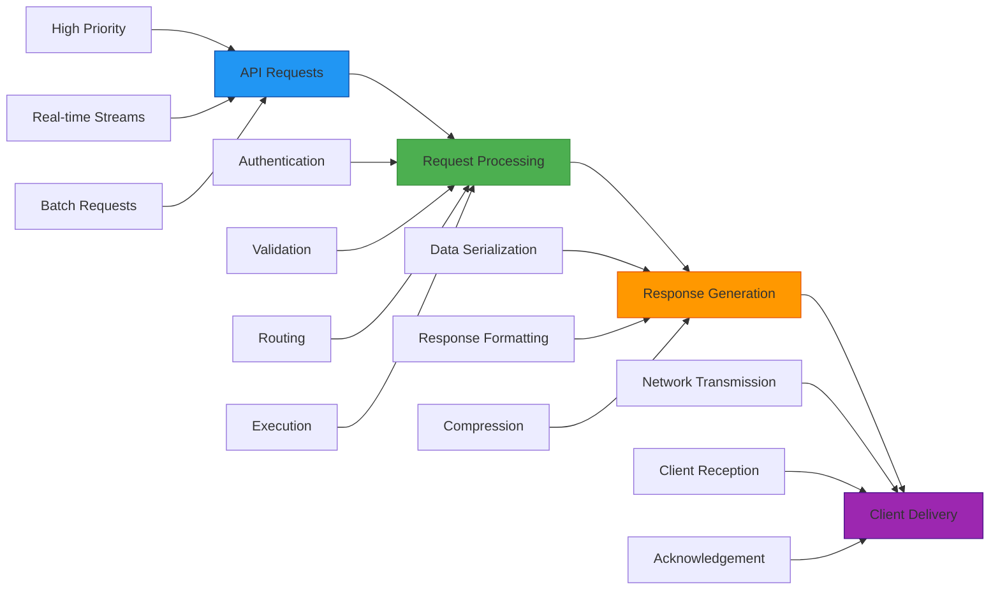

## 🔄 WebSocket API

Real-time data streaming is available through WebSocket connections.

### Connection
```
ws://localhost:3000/ws
```

### Messages

#### Client to Server
```json
{
  "type": "subscribe",
  "topic": "eeg_data"
}
```

#### Server to Client
```json
{
  "type": "eeg_data",
  "data": {
    "timestamp": "2025-11-16T10:30:45Z",
    "channels": [0.5, 0.6, 0.4, 0.7, 0.3, 0.8],
    "bands": {
      "alpha": 0.7,
      "beta": 0.3,
      "theta": 0.6,
      "delta": 0.2,
      "gamma": 0.1
    }
  }
}
```

### WebSocket Communication Flow



### Real-time Data Pipeline



## 🌐 Cross-Modal API Integration

### Complete API Integration Architecture



### Cross-Modal API Data Flow



### API Endpoint Classification



### Real-time API Performance Metrics

