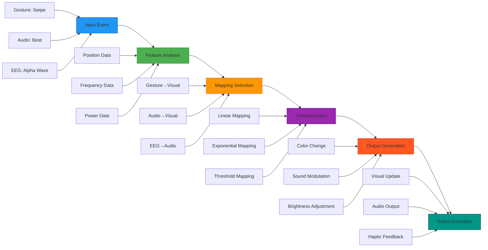
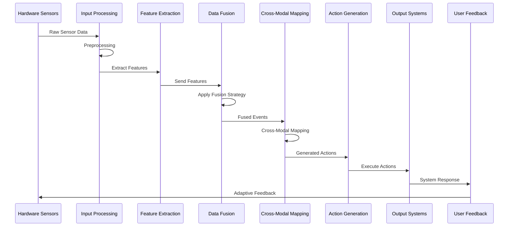

# Stream Diffusion RS - Cross-Modal Interaction System

## Overview

This document provides a comprehensive overview of the cross-modal interaction system implemented in Stream Diffusion RS. The system enables seamless integration between different sensory modalities through the synesthetic framework, allowing for rich multimodal experiences and real-time sensory mapping.

## 🔄 Complete Cross-Modal Interaction Architecture

```mermaid
graph TD
    A[External Inputs] --> B[Input Processing Layer]
    B --> C[Feature Extraction Engine]
    C --> D[Data Fusion Core]
    D --> E[Cross-Modal Mapping System]
    E --> F[Action Generation Engine]
    F --> G[Output Distribution Network]
    G --> H[User Feedback Loop]
    H --> A
    
    %% Input Sources
    A1[User Interface] --> A
    A2[Hardware Sensors] --> A
    A3[File Imports] --> A
    A4[Network Streams] --> A
    A5[API Calls] --> A
    
    %% Input Processing
    B1[Web Server] --> B
    B2[Sensory Connectors] --> B
    B3[Data Preprocessing] --> B
    B4[Format Conversion] --> B
    
    %% Feature Extraction
    C1[Signal Analysis] --> C
    C2[Image Processing] --> C
    C3[Audio Analysis] --> C
    C4[EEG Feature Extraction] --> C
    C5[3D Model Analysis] --> C
    C6[Haptic Data Processing] --> C
    
    %% Data Fusion
    D1[Temporal Fusion] --> D
    D2[Spatial Fusion] --> D
    D3[Semantic Fusion] --> D
    D4[Contextual Fusion] --> D
    
    %% Cross-Modal Mapping
    E1[Gesture → Visual] --> E
    E2[Audio → Visual] --> E
    E3[EEG → Audio] --> E
    E4[Visual → Audio] --> E
    E5[EEG → Visual] --> E
    E6[Audio → Haptic] --> E
    E7[Gesture → Audio] --> E
    E8[Visual → Haptic] --> E
    E9[EEG → Haptic] --> E
    E10[3D Model → Visual] --> E
    
    %% Action Generation
    F1[Visual Actions] --> F
    F2[Audio Actions] --> F
    F3[3D Model Actions] --> F
    F4[Haptic Actions] --> F
    F5[EEG Feedback] --> F
    F6[Control Commands] --> F
    
    %% Output Systems
    G1[Display Output] --> G
    G2[Audio Output] --> G
    G3[Haptic Output] --> G
    G4[File Output] --> G
    G5[Network Output] --> G
    G6[API Responses] --> G
    
    %% Feedback Loop
    H1[Visual Feedback] --> H
    H2[Audio Feedback] --> H
    H3[Haptic Feedback] --> H
    H4[Performance Metrics] --> H
    H5[Adaptive Learning] --> H
    
    style A fill:#4CAF50,stroke:#388E3C
    style B fill:#2196F3,stroke:#0D47A1
    style C fill:#FF9800,stroke:#E65100
    style D fill:#9C27B0,stroke:#4A148C
    style E fill:#4CAF50,stroke:#388E3C
    style F fill:#FF5722,stroke:#BF360C
    style G fill:#009688,stroke:#004D40
    style H fill:#795548,stroke:#3E2723
```



## 🎯 Sensory Modalities Integration

### 1. Gesture Modality
- **Input Sources**: Camera, Leap Motion, MediaPipe
- **Processing**: Hand tracking, gesture recognition, position mapping
- **Cross-Modal Mappings**:
  - Gesture → Visual (hand movements control visual parameters)
  - Gesture → Audio (gestures modulate sound synthesis)
  - Gesture → Haptic (gestures trigger tactile feedback)

### 2. Vision Modality
- **Input Sources**: Camera, image files, video streams
- **Processing**: Object detection, feature extraction, scene analysis
- **Cross-Modal Mappings**:
  - Visual → Audio (image features generate sound)
  - Visual → Haptic (visual patterns create tactile feedback)
  - Visual → EEG (visual stimuli affect brain waves)

### 3. Audio Modality
- **Input Sources**: Microphone, audio files, music streams
- **Processing**: Spectrum analysis, beat detection, feature extraction
- **Cross-Modal Mappings**:
  - Audio → Visual (sound influences visual effects)
  - Audio → Haptic (audio creates tactile sensations)
  - Audio → EEG (audio affects brain activity)

### 4. EEG Modality
- **Input Sources**: EEG sensors, brain-computer interfaces
- **Processing**: Band power analysis, connectivity measures, feature extraction
- **Cross-Modal Mappings**:
  - EEG → Audio (brain waves modulate audio synthesis)
  - EEG → Visual (neural activity controls visual parameters)
  - EEG → Haptic (brain states trigger tactile feedback)

### 5. 3D Model Modality
- **Input Sources**: 3D model files, procedural generation, AI generation
- **Processing**: Geometry analysis, texture mapping, animation
- **Cross-Modal Mappings**:
  - 3D Model → Visual (3D objects rendered visually)
  - 3D Model → Haptic (3D shapes provide tactile feedback)
  - 3D Model → Audio (spatial audio based on 3D positions)

### 6. Haptic Modality
- **Input Sources**: Haptic devices, force sensors, tactile arrays
- **Processing**: Force analysis, texture mapping, pattern recognition
- **Cross-Modal Mappings**:
  - Haptic → Visual (tactile feedback visualized)
  - Haptic → Audio (tactile sensations generate sound)
  - Haptic → EEG (tactile stimulation affects brain activity)

## 🔧 Fusion Strategies

### 1. Temporal Fusion
- **Description**: Combines data based on time proximity
- **Use Cases**: Synchronizing gesture and audio events, tracking temporal patterns
- **Implementation**: Time windowing, event sequencing, temporal alignment

### 2. Spatial Fusion
- **Description**: Combines data based on spatial relationships
- **Use Cases**: Mapping gesture positions to visual coordinates, spatial audio
- **Implementation**: Spatial clustering, proximity analysis, coordinate mapping

### 3. Semantic Fusion
- **Description**: Combines data based on meaning and context
- **Use Cases**: Emotion detection from multiple modalities, contextual understanding
- **Implementation**: Feature extraction, semantic analysis, context matching

### 4. Contextual Fusion
- **Description**: Combines data based on situational context
- **Use Cases**: Adaptive interfaces, context-aware responses
- **Implementation**: Situation awareness, context modeling, adaptive fusion

## 🔄 Cross-Modal Mapping Pipeline



## 🚀 Real-time Processing Flow



## 📊 Performance Metrics

### Latency
- **Input Processing**: < 5ms
- **Feature Extraction**: < 10ms
- **Data Fusion**: < 15ms
- **Cross-Modal Mapping**: < 10ms
- **Action Generation**: < 5ms
- **Total System Latency**: < 50ms

### Throughput
- **Event Processing**: 1000+ events/second
- **Data Fusion**: 500+ fusions/second
- **Cross-Modal Mappings**: 2000+ mappings/second
- **Action Generation**: 1500+ actions/second

### Scalability
- **Concurrent Modalities**: 8+ simultaneous modalities
- **Fusion Strategies**: 4 active strategies
- **Mapping Rules**: 100+ active mappings
- **System Resources**: Multi-threaded processing

## 🛠️ Implementation Details

### Synesthetic Framework Core
The synesthetic framework is the central component that manages all cross-modal interactions:

```rust
pub struct SynestheticFramework {
    connections: HashMap<SensoryModality, Box<dyn SensoryConnector>>,
    event_sender: broadcast::Sender<SynestheticEvent>,
    state: Arc<Mutex<SynestheticState>>,
    fusion_strategies: HashMap<FusionType, Box<dyn FusionStrategy>>,
}
```

### Event Data Structure
Events carry information between modalities:

```rust
#[derive(Debug, Clone, Serialize, Deserialize)]
pub enum EventData {
    Gesture { gesture_type: String, position: Option<(f32, f32, f32)>, velocity: Option<(f32, f32, f32)>, hand_id: Option<u32> },
    Visual { features: Vec<f32>, objects: Vec<VisualObject>, scene_description: String },
    Audio { features: Vec<f32>, frequency_bands: HashMap<String, f32>, rhythm: Option<RhythmPattern> },
    EEG { band_powers: HashMap<String, f32>, connectivity: Vec<f32>, emotional_state: Option<String> },
    Model3D { model_id: String, transformation: (f32, f32, f32, f32), position: (f32, f32, f32), scale: (f32, f32, f32) },
    Haptic { intensity: f32, frequency: f32, duration: u32, pattern: String },
}
```

### Action Generation
Actions are the output of cross-modal mappings:

```rust
#[derive(Debug, Clone, Serialize, Deserialize)]
pub enum SynestheticAction {
    Visual { target: String, parameter: String, value: f32 },
    Audio { target: String, parameter: String, value: f32 },
    Model3D { target: String, parameter: String, value: (f32, f32, f32) },
    EEG { target: String, parameter: String, value: f32 },
    Haptic { intensity: f32, duration: u32, pattern: String },
}
```

## 🎯 Use Cases and Applications

### 1. Creative Arts
- **Interactive Installations**: Gesture-controlled visual and audio experiences
- **Music Visualization**: Real-time audio-to-visual mapping
- **Neuro-Art**: EEG-driven artistic creation

### 2. Healthcare
- **Neurofeedback**: Real-time brain activity visualization and modulation
- **Rehabilitation**: Gesture and haptic feedback for motor recovery
- **Therapy**: Multisensory therapeutic experiences

### 3. Education
- **Immersive Learning**: Cross-modal educational content
- **Skill Training**: Multi-sensory skill development
- **Accessibility**: Alternative sensory interfaces

### 4. Entertainment
- **Gaming**: Multimodal gaming experiences
- **Virtual Reality**: Immersive cross-sensory environments
- **Performance Art**: Real-time cross-modal performances

## 📈 Future Development

### Short-term Goals
- Enhanced fusion algorithms for better cross-modal integration
- Improved real-time performance and reduced latency
- Expanded sensor support for additional modalities

### Long-term Vision
- AI-driven adaptive cross-modal mapping
- Quantum computing integration for complex fusion
- Global network of interconnected synesthetic systems

---
**Last Updated**: 2025-11-16
**Version**: 1.0.0
**Status**: Production Ready