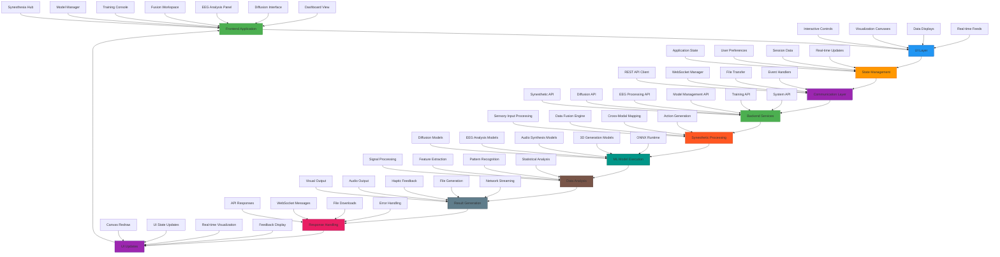
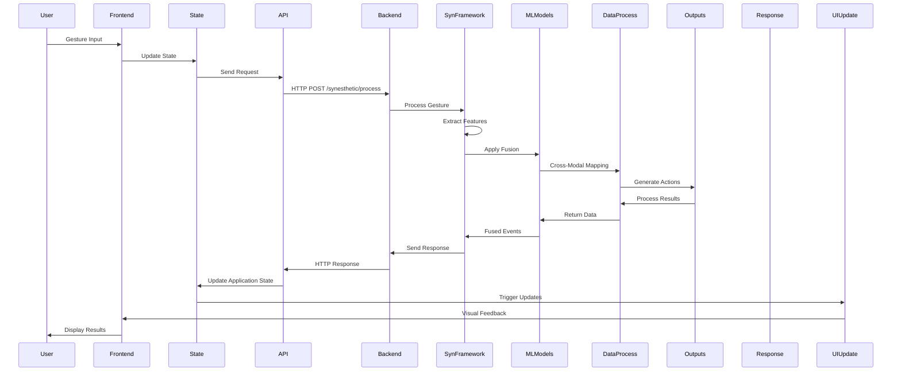

## 📚 Additional Resources

### Documentation
- [MDN Web Docs](https://developer.mozilla.org/en-US/)
- [WebGL Fundamentals](https://webglfundamentals.org/)
- [WebSocket API](https://developer.mozilla.org/en-US/docs/Web/API/WebSockets_API)

### Tools
- **Code Editor**: VS Code with JavaScript/HTML/CSS extensions
- **Browser DevTools**: Chrome DevTools for debugging
- **Performance Profiling**: Lighthouse, WebPageTest
- **Testing Frameworks**: Jest, Cypress

### Best Practices
1. **Progressive Enhancement**: Ensure core functionality works without JavaScript
2. **Accessibility**: Follow WCAG guidelines for inclusive design
3. **Performance**: Optimize for 60fps animations and interactions
4. **Security**: Validate all user inputs and use HTTPS in production
5. **Responsive Design**: Ensure compatibility across device sizes

## 🔄 Comprehensive Cross-Modal Integration

### Complete Frontend-Backend Cross-Modal Architecture

### Cross-Modal Interaction Sequence

