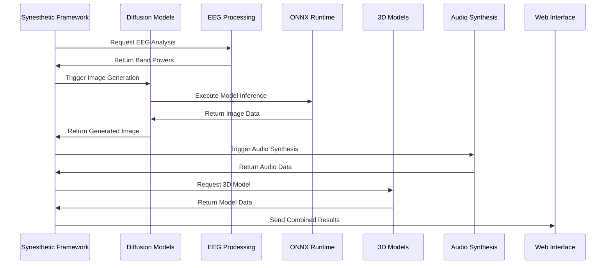
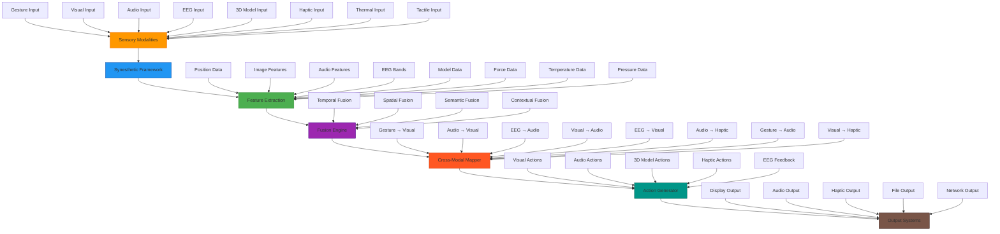
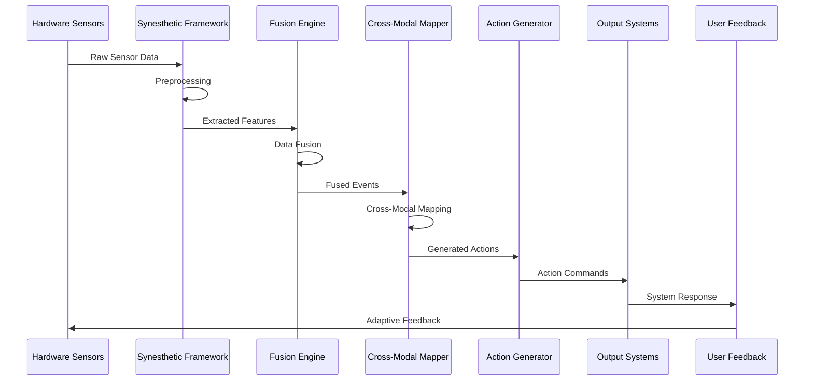
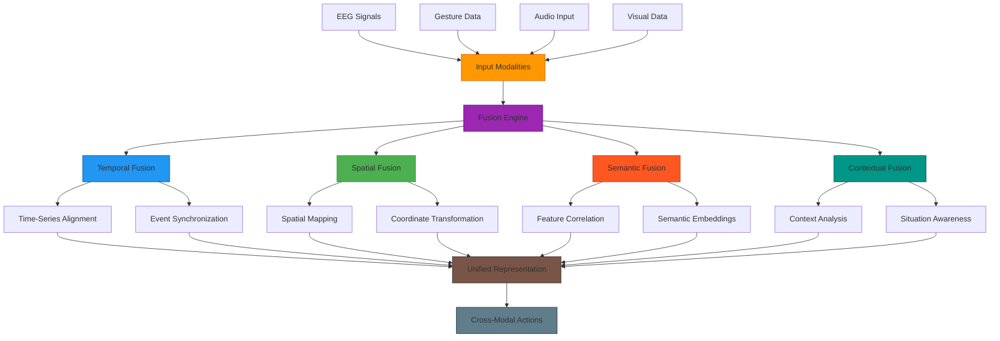
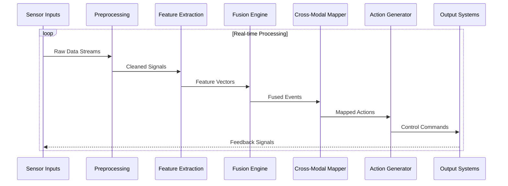

## 🎯 Usage Examples

### Basic Setup

```rust
use stream_diffusion_rs::synesthesia::*;

#[tokio::main]
async fn main() -> Result<(), Box<dyn std::error::Error>> {
    // Create the synesthetic framework
    let mut framework = SynestheticFramework::new()?;
    
    // Activate modalities
    framework.activate_modality(SensoryModality::Gesture)?;
    framework.activate_modality(SensoryModality::Audio)?;
    framework.activate_modality(SensoryModality::EEG)?;
    
    // Process gesture input
    let gesture_input = SensoryInput::Gesture(GestureInput {
        hand_positions: vec![(100.0, 200.0, 0.0)],
        gesture_type: "swipe_left".to_string(),
    });
    
    let events = framework.process_input(SensoryModality::Gesture, gesture_input).await?;
    
    // Apply cross-modal mappings
    for event in events {
        let actions = framework.apply_cross_modal_mappings(&event).await?;
        println!("Generated {} actions", actions.len());
    }
    
    Ok(())
}
```

### Fusion Processing

```rust
use stream_diffusion_rs::synesthesia::*;

async fn process_multimodal_data(
    framework: &SynestheticFramework,
    gesture_events: Vec<SynestheticEvent>,
    audio_events: Vec<SynestheticEvent>,
) -> Result<SynestheticEvent, Box<dyn std::error::Error>> {
    // Combine events from different modalities
    let mut all_events = gesture_events;
    all_events.extend(audio_events);
    
    // Fuse events using temporal strategy
    let fused_event = framework.fuse_events(
        all_events, 
        FusionType::Temporal
    ).await?;
    
    Ok(fused_event)
}
```

### Cross-Modal Mapping

```rust
use stream_diffusion_rs::synesthesia::*;

async fn handle_gesture_event(
    framework: &SynestheticFramework,
    event: &SynestheticEvent,
) -> Result<Vec<SynestheticAction>, Box<dyn std::error::Error>> {
    match &event.data {
        EventData::Gesture { gesture_type, position, .. } => {
            match gesture_type.as_str() {
                "swipe_left" => {
                    Ok(vec![SynestheticAction::Visual {
                        target: "diffusion".to_string(),
                        parameter: "hue".to_string(),
                        value: -0.1,
                    }])
                }
                "swipe_right" => {
                    Ok(vec![SynestheticAction::Visual {
                        target: "diffusion".to_string(),
                        parameter: "hue".to_string(),
                        value: 0.1,
                    }])
                }
                "pinch" => {
                    Ok(vec![SynestheticAction::Audio {
                        target: "synth".to_string(),
                        parameter: "frequency".to_string(),
                        value: 0.5,
                    }])
                }
                _ => Ok(vec![])
            }
        }
        _ => Ok(vec![])
    }
}
```

## 🔧 Integration with Other Modules

### Module Interaction Diagram

```mermaid
graph TD
    A[Synesthetic Framework] --> B[Diffusion Models]
    A --> C[EEG Processing]
    A --> D[ONNX Runtime]
    A --> E[3D Model Generation]
    A --> F[Audio Synthesis]
    A --> G[Web Interface]
    
    B --> B1[Image Generation]
    B --> B2[Text Encoding]
    B --> B3[Model Inference]
    
    C --> C1[Signal Analysis]
    C --> C2[Frequency Bands]
    C --> C3[Feature Extraction]
    
    D --> D1[Model Loading]
    D --> D2[Hardware Acceleration]
    D --> D3[Inference Execution]
    
    E --> E1[Geometry Creation]
    E --> E2[Texture Mapping]
    E --> E3[Animation Processing]
    
    F --> F1[Waveform Generation]
    F --> F2[Audio Effects]
    F --> F3[Sound Synthesis]
    
    G --> G1[API Endpoints]
    G --> G2[WebSocket Streaming]
    G --> G3[UI Components]
    
    style A fill:#2196F3,stroke:#0D47A1
    style B fill:#9C27B0,stroke:#4A148C
    style C fill:#4CAF50,stroke:#388E3C
    style D fill:#FF9800,stroke:#E65100
    style E fill:#FF5722,stroke:#BF360C
    style F fill:#009688,stroke:#004D40
    style G fill:#795548,stroke:#3E2723
```



### Data Flow Between Modules



## 🔄 Cross-Modal Interaction System

### Complete Cross-Modal Mapping Architecture



### Cross-Modal Interaction Flow



### Cross-Modal Fusion Strategies



### Real-time Cross-Modal Processing Pipeline

