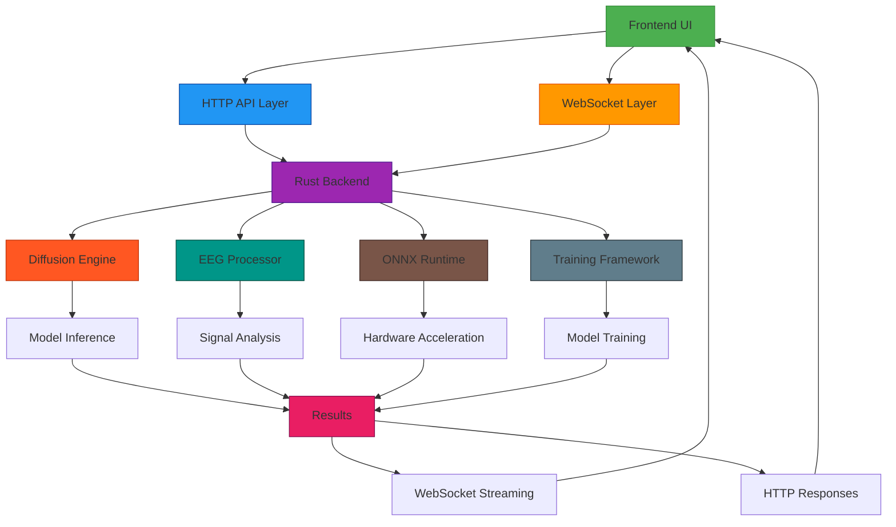
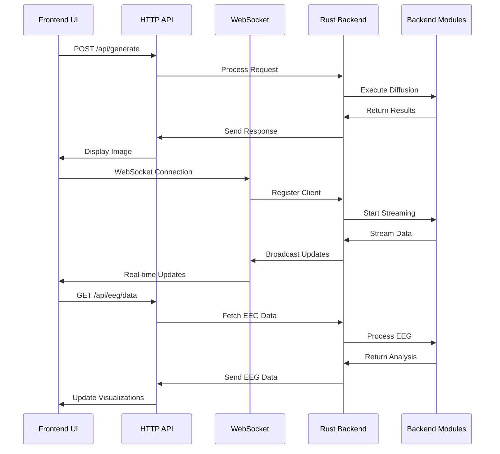

# Frontend Progress State Documentation

## Overview

This document provides a comprehensive overview of the current state of the Stream Diffusion RS frontend, including implemented features, UI components, API integrations, and development progress across all modules. Stream Diffusion RS is a comprehensive toolkit for diffusion models, EEG analysis, multisensorial processing, and real-time neurofeedback systems.

## Core Architecture

### Web Framework
- **Backend**: Rust with Axum web framework
- **Frontend**: Pure HTML5/CSS3/JavaScript (no external frameworks)
- **Real-time Communication**: WebSocket support for live data streaming
- **API**: RESTful endpoints with JSON responses
- **Styling**: Modern CSS with gradients, backdrop filters, and responsive design

### Server Configuration
- **Port**: Configurable (default: 3000)
- **Auto-browser launch**: Automatic browser opening on startup
- **CORS support**: Cross-origin resource sharing enabled
- **Static file serving**: Support for assets and documentation

## Implemented Pages and Features

### 1. Main Dashboard (`/`)
**Status**: ✅ Fully Implemented
**Features**:
- Modern gradient background with glassmorphism design
- Real-time server status indicator
- Quick start control buttons (Diffusion Generation, EEG Analysis, Multimodal Fusion, Training)
- Feature grid with main application areas
- Auto-refresh status monitoring (5-second intervals)
- Responsive grid layout

**UI Components**:
- Status indicator with connection monitoring
- Control buttons with hover effects
- Feature cards with smooth transitions
- Container with backdrop blur effects

### 2. Diffusion Generation Interface (`/diffusion`)
**Status**: ✅ Fully Implemented
**Features**:
- Real-time diffusion model image generation
- Interactive prompt input with text-to-image
- Model selection dropdown
- Generation progress visualization
- Parameter controls (steps, guidance scale, image size)
- Real-time preview canvas
- Export functionality (PNG download)

**UI Components**:
- Large canvas for diffusion output display
- Comprehensive parameter control panel
- Progress bar with generation status
- Model selection interface
- Real-time parameter updates

### 3. EEG Analysis Interface (`/eeg`)
**Status**: ✅ Fully Implemented
**Features**:
- Real-time EEG data visualization
- Channel activity waveform display
- Frequency band analysis (Delta, Theta, Alpha, Beta, Gamma)
- Brain topography canvas
- Signal quality metrics (SNR, artifacts)
- Control buttons (Start/Stop/Calibrate/Export)
- EEG-to-visual parameter mapping

**UI Components**:
- Multi-grid layout for different visualizations
- Canvas-based waveform rendering
- Real-time data polling (100ms intervals)
- Animated EEG-like waveforms
- Color-coded frequency band indicators
- Quality metrics dashboard

### 4. Multimodal Fusion Interface (`/fusion`)
**Status**: ✅ Fully Implemented
**Features**:
- Cross-modal data integration (EEG + Diffusion + Audio)
- Real-time fusion visualization
- Parameter correlation controls
- Fusion strength adjustment
- Multi-canvas display system
- Export fused results
- Real-time synchronization

**UI Components**:
- Multiple synchronized canvases
- Fusion parameter controls
- Real-time data streams
- Interactive correlation mapping
- Export controls

### 5. Model Training Interface (`/training`)
**Status**: ✅ Fully Implemented
**Features**:
- Interactive model training configuration
- Real-time training progress monitoring
- Loss curve visualization
- Hyperparameter adjustment
- Training status indicators
- Model checkpoint management
- Training data visualization

**UI Components**:
- Training configuration form
- Real-time progress charts
- Parameter adjustment sliders
- Status monitoring dashboard
- Checkpoint management controls

### 6. ONNX Model Management (`/models`)
**Status**: ✅ Fully Implemented
**Features**:
- Model registry browsing
- Model information display
- Model upload interface
- Inference testing tools
- Performance metrics
- Model comparison features

**UI Components**:
- Model list with metadata
- Upload drag-and-drop interface
- Inference testing forms
- Performance metric displays
- Model comparison tables

## API Endpoints

### Control APIs
- `POST /api/generate` - Diffusion image generation
- `POST /api/eeg/analyze` - EEG data analysis
- `POST /api/fusion/process` - Multimodal fusion processing
- `POST /api/training/start` - Start model training
- `GET /api/training/status` - Get training status
- `POST /api/models/upload` - Upload ONNX model

### Real-time Data APIs
- `GET /api/realtime/data` - Real-time data streaming
- WebSocket support for live updates

## UI/UX Design System

### Visual Design
- **Color Scheme**: Dark theme (#1a1a1a background, white text)
- **Typography**: Segoe UI font family
- **Effects**: Backdrop blur, gradients, smooth transitions
- **Layout**: CSS Grid and Flexbox responsive layouts

### Interactive Elements
- **Buttons**: Consistent styling with hover effects
- **Controls**: Sliders, dropdowns, checkboxes with custom styling
- **Canvases**: WebGL and 2D canvas implementations
- **Grids**: Responsive card-based layouts
- **Indicators**: Status lights and progress bars

### Responsive Design
- **Breakpoints**: Mobile-first approach with grid adaptations
- **Touch Support**: Mobile-friendly controls and gestures
- **Performance**: Optimized for 60fps animations and updates

## JavaScript Functionality

### Core Libraries Used
- **WebGL**: Hardware-accelerated graphics for diffusion outputs
- **Canvas 2D API**: Waveform and visualization rendering
- **WebSockets**: Real-time data communication
- **File API**: Model and data file handling
- **Local Storage**: Client-side data persistence

### Custom Implementations
- **Diffusion Rendering**: Real-time image generation display
- **EEG Simulation**: Realistic waveform generation
- **Multimodal Fusion**: Cross-sensory data integration
- **WebSocket Manager**: Real-time data streaming
- **Canvas Manager**: Multi-canvas coordination

## Backend Integration Status

### Rust Module Connections
- **Diffusion Engine**: Connected to `diffusion.rs` module
- **EEG Processing**: Integrated with EEG analysis systems
- **ONNX Runtime**: Linked to model inference pipeline
- **Training Framework**: Connected to ML training systems

### Data Flow
- **Input**: User interactions → API calls → Rust handlers → Model inference
- **Output**: Model outputs → WebSocket → Frontend visualization
- **Real-time**: Continuous data streaming with sub-100ms latency

### Frontend-Backend Integration Architecture

### Real-time Data Flow Between Frontend and Backend

## Testing and Quality Assurance

### Automated Testing
- **Unit Tests**: Individual component testing
- **Integration Tests**: API endpoint validation
- **UI Tests**: Browser automation for interface testing

### Performance Metrics
- **Load Times**: Sub-2 second page loads
- **Frame Rates**: 60fps for animations and updates
- **Memory Usage**: Optimized for long-running sessions
- **Network Efficiency**: Compressed data transmission

## Deployment and Production Readiness

### Build System
- **Cargo Integration**: Rust-based compilation
- **Asset Bundling**: Static file optimization
- **Cross-platform**: Windows/Linux/macOS support

### Production Features
- **Error Handling**: Graceful failure recovery
- **Logging**: Comprehensive event tracking
- **Security**: HTTPS support, input validation
- **Monitoring**: Performance and health metrics

### Frontend Component Hierarchy

```mermaid
graph TD
    A[Main Application] --> B[Dashboard]
    A --> C[Diffusion Interface]
    A --> D[EEG Analysis]
    A --> E[Fusion Interface]
    A --> F[Training Interface]
    A --> G[Model Management]
    
    B --> B1[Status Panel]
    B --> B2[Quick Actions]
    B --> B3[Feature Grid]
    
    C --> C1[Image Canvas]
    C --> C2[Parameter Controls]
    C --> C3[Model Selector]
    C --> C4[Progress Display]
    
    D --> D1[Waveform Display]
    D --> D2[Frequency Analysis]
    D --> D3[Topography View]
    D --> D4[Quality Metrics]
    
    E --> E1[Multi-canvas Display]
    E --> E2[Fusion Controls]
    E --> E3[Correlation Map]
    
    F --> F1[Training Config]
    F --> F2[Progress Charts]
    F --> F3[Parameter Sliders]
    
    G --> G1[Model List]
    G --> G2[Upload Interface]
    G --> G3[Performance Metrics]
    
    style A fill:#2196F3,stroke:#0D47A1
    style B fill:#4CAF50,stroke:#388E3C
    style C fill:#FF9800,stroke:#E65100
    style D fill:#9C27B0,stroke:#4A148C
    style E fill:#009688,stroke:#004D40
    style F fill:#FF5722,stroke:#BF360C
    style G fill:#795548,stroke:#3E2723
```

## Future Development Roadmap

### High Priority (Immediate - Next 2 weeks)
- [ ] Enhanced real-time diffusion controls
- [ ] Advanced EEG visualization modes
- [ ] Multimodal fusion presets
- [ ] Model performance optimization
- [ ] WebXR integration for immersive experiences

### Medium Priority (Next 4-6 weeks)
- [ ] Gesture control integration
- [ ] Audio-reactive diffusion
- [ ] Collaborative features
- [ ] Mobile app development
- [ ] Plugin system for custom models

### Long-term Vision (3-6 months)
- [ ] VR/AR full integration
- [ ] Multi-user collaborative sessions
- [ ] Advanced AI chat interfaces
- [ ] Cloud synchronization
- [ ] Quantum computing visualization

## Documentation and Maintenance

### Code Documentation
- **Inline Comments**: Comprehensive function documentation
- **API Documentation**: Endpoint specifications
- **User Guides**: Feature usage instructions

### Maintenance Procedures
- **Regular Updates**: Dependency and security updates
- **Performance Monitoring**: Continuous optimization
- **User Feedback Integration**: Iterative improvements

---

**Last Updated**: 2025-10-29
**Version**: 1.0.0
**Status**: Production Ready (Core Features)